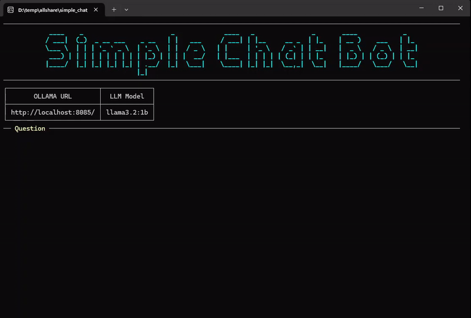

# Running LLMs Locally (langchain, ollama, chromadb)

Project process an list pf pdf document uses mxbai-embed-large for embedding and deepseek-r1:1.5b for LLM.
Alternative models can be used and tested (pased as parameters).

The project consist of two distinct runs.
1. Create Embeddings
2. RAG (against exiting embeddings)

## OLLAMA

- Download & Install OLLAMA [Ollama Download](https://ollama.com/)
- Check available models at [Ollama Models](https://ollama.com/search)
- set environment variable by the name OLLAMA_MODELS to save models in alternative location
- download models using following commands
  
  ```
    ollama pull deepseek-r1:1.5b
    ollama pull mxbai-embed-large
    ollama pull llama3.2:1b

- start model serving 
  
  ```
  ollama serve

## Usage (CLI)

- Ensure anaconda is installed [Anaconda Download](https://www.anaconda.com/download)
- Clone git repo
- Create new virtual environment
```
conda create -p venv python==3.12
```

- Activate new virtual environment
```
conda activate ./venv
```

- Deploy requirements
```
pip install chromadb langchain gradio pypdf
pip install -U langchain_community
pip install -U langchain_ollama
pip install -U langchain_chroma
```

- Create Embeddings
```
python ./create_embeddings.py
```

- Query
```
- python ./query01.py
- python ./query02.py
```

## Sample Outputs

<strong>CLI Outputs/strong>



<strong>deepseek-r1:1b</strong>


<strong>llama3.2:1b</strong>


<strong>deepseek-r1</strong>


<strong>Gradio Sample Outputs</strong>


### Remarks
Project is for a quick demo only.